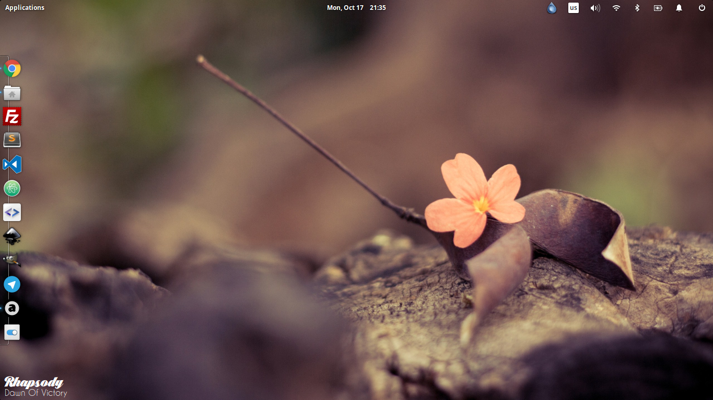

# DiscreteAudacious - Conky plugin

Displays song details played by audcaious in the bottom left edge of the screen

# Preview



# Installation

## Requirements

You should have installed:

- conky
- audacious

## Fonts

First install fonts located in `fonts/` folder or change font families in `plugin/plugin.conky` file

Lines:
```
${voffset 10}${color white}${font Black Larch PERSONAL USE ONLY:size=22}${exec ./aud-artist.sh}${font}
${color white}${exec ./aud-song.sh}${font Caviar Dreams:size=12}${font}
```

Replace `Black Larch PERSONAL USE ONLY` or `Caviar Dreams` with font names you want

## Install script

Run script:

```bash
$ sh install.sh
```

Script will create a `Discrete Audacious/` folder in `~/.conky/` folder and copy contents of `plugin/` folder there

## Enable plugin

Open conky manager and make sure that installed widget is enabled